Chicago Child Care and Public Health Analysis
================
Dana KilbourneRuthie MontellaAziz Al Mezraani
Spring 2025

- [Overview and Goal of Study](#overview-and-goal-of-study)
- [Data Description](#data-description)
- [Introduction](#introduction)
- [Objectives](#objectives)
- [Findings](#findings)
- [Exploratory Data Analysis (EDA)](#exploratory-data-analysis-eda)
  - [Data Preparation](#data-preparation)
  - [Investigating Socioeconomic
    Factors](#investigating-socioeconomic-factors)
  - [Investigating Mortality Factors](#investigating-mortality-factors)
  - [Mapping](#mapping)
- [Model Training](#model-training)
  - [Linear Regression](#linear-regression)
  - [LASSO Regression](#lasso-regression)
  - [Neural Network](#neural-network)
  - [Double Debiased Model](#double-debiased-model)
  - [Model Comparison](#model-comparison)
- [Conclusions](#conclusions)
- [Appendix](#appendix)

# Overview and Goal of Study

The primary objective of our project is to explore the potential
correlation between health indicators in Chicago and socioeconomic
background factors. By analyzing this relationship, we aim to uncover
insights that could inform policies and initiatives designed to address
health disparities in underserved communities. Ultimately, our goal is
to provide valuable data-driven recommendations that will help
policymakers and community leaders allocate resources more effectively
and create targeted interventions where they are most needed.

# Data Description

We used two data sets from two different sources: Chicago Health Atlas
(<https://chicagohealthatlas.org/>), Illinois Action for Children
(<https://www.actforchildren.org/about/research-data/data/>). The first
dataset from the Chicago Health Atlas includes a wide range of
health-related variables categorized into four general areas: natality,
mortality, lead exposure, infectious diseases, and economic factors.
This dataset provides detailed insights into the health conditions and
challenges faced by different communities within Chicago. The second
dataset from Illinois Action for Children, which contains census data on
the number of children across different age ranges, the availability of
full-time licensed child care centers, and the number of additional
childcare slots available in each community area. These datasets give us
the tools for a comprehensive analysis of the relationship between
health outcomes and socioeconomic factors, with a particular focus on
the impact of access to childcare and broader community health
indicators.

# Introduction

This project aims to explore and analyze the relationship between
socioeconomic factors, mortality factors, and infant mortality rates in
the community areas of Chicago, IL. By investigating public health data
obtained from the Chicago Health Atlas and Act for Children, the goal is
to identify which factors most significantly contribute to infant
mortality rate in the community areas of Chicago. We want to understand
the underlying causes that could contribute to the disparities in infant
mortality rate according to community area.

# Objectives

- Identify key socioeconomic factors: We want to investigate which
  variables such as: per capita income, percent of the population in
  crowded housing, percentage of the population without a high school
  diploma, teen birth rate, low birth weight, and more have an effect on
  the infant mortality rate. Does the community area in Chicago impact
  the infant mortality rate? How do these factors correlate with infant
  mortality rate in Chicago community areas?
- Identify key mortality factors: We want to investigate the health data
  that we have obtained containing factors such as: mortality rate from
  diabetes, breast cancer, colorectal cancer, firearms, lung cancer,
  cerebrovascular diseases, and more to see how these factors correlate
  with infant mortality rate. Does the health environment of the area
  impact infant mortality rate?
- Understand disparities between community areas: Some community areas
  may be more fortunate than others when it comes to both mortality and
  socioeconomic factors, and we aim to see if this privilege affects the
  population.

# Findings

Our analysis reveals several important correlations that suggest a
complex relationship between socioeconomic factors and infant mortality
rates in Chicago. Specifically, variables such as unemployment rate,
teen birth rate, and low birth weight exhibit strong positive
correlations with infant mortality, implying that higher levels of these
factors in certain communities are associated with higher infant
mortality rates. Additionally, factors like per capita income and
education levels show moderate to weak correlations with infant
mortality, further highlighting the importance of addressing poverty and
education to improve health outcomes. The mapping of these variables
across different community areas further revealed that areas with lower
income and higher unemployment also tend to have higher rates of infant
mortality, underscoring the compounded effects of socioeconomic
disadvantage.

# Exploratory Data Analysis (EDA)

## Data Preparation

Our first steps in examining our data sources was to become familiar
with all variables via the source’s data dictionaries, ensure
appropriate data types for each variable, and check summary statistics
for missing values. We noticed right away that when we combined the two
datasets the row representing the Montclare community area had NAs for
almost all of its values. Initially we hypothesized that maybe this
community area was not present in both datasets, but once we double
checked and found it in both sources we took a closer look. We then
realized there was a spelling error in the Illinois Action for Children
dataset which was preventing the data from being merged correctly for
this community area. After fixing this error by renaming the community
area appropriately we were able to resolve this issue.

## Investigating Socioeconomic Factors

To explore the data relating to socioeconomic factors, we did a quick
look into the summary statistics for infant mortality rate to identify
differences by Chicago community area. We found a minimum of 1.5 deaths
per 1,000 live births and a maximum of 22.6 per 1,000 live births. This
difference is definitely significant and drove our curiosity to continue
exploring this variable.
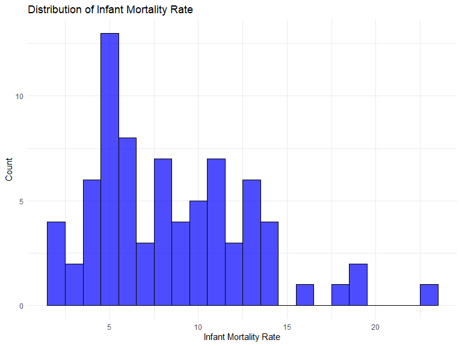

Next we decided to examine the strength of correlations between certain
variables. The correlation between having no high school diploma and
infant mortality rate is a weak, positive correlation of 0.102. The
correlation between per capita income and infant mortality rate of
-0.439 reveals a moderate negative relationship- meaning as per capita
income increases, the infant mortality rate tends to decrease. Some of
the higher correlations were found to be between infant mortality rate
and unemployment (0.789), infant mortality rate and low birth weight
(0.678), and infant mortality rate and teen birth rate correlation
(0.627). These correlations preliminarily suggest that infant mortality
rate is more dependent on these factors meaning that infant mortality is
significantly higher in community areas where unemployment rate, the
teen birth rate, and the per capita income all tend to be higher.

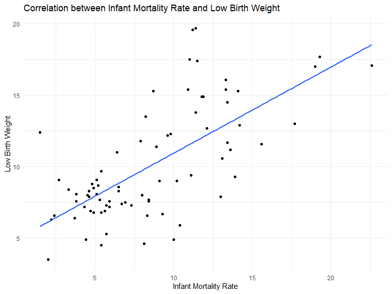
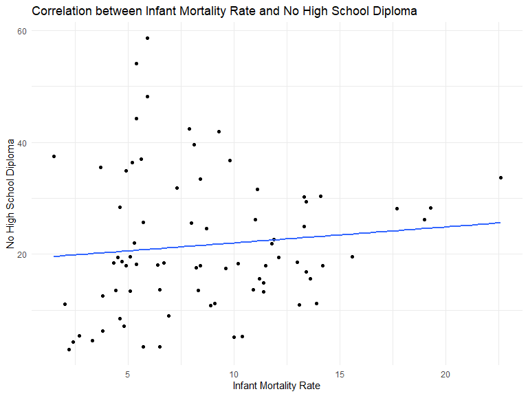

Our next consideration was to identify the most common causes of
mortality in each community area to identify which are the most
prevalent. We began by using which.max() to individually check for
certain community areas but then realized it would be much more
effective to formulate code that would compare all percentages across
each row and identify the highest one. Once we did this we just added a
new column to our data frame, `Highest_Mortaility_Cause`, so we could
more easily pull this number. This new calculation revealed that the
most common cause for mortality among the Chicago community areas is
diabetes related. This was not terribly surprising since “diabetes
related” could encompass many things and diabetes is already a common
disease.

We next grouped infant mortality rates into quartiles to assess the
correlations in a table. Some socioeconomic factors, like crowded
housing and not having a high school diploma do not correlate as
perfectly as others do in these quartile ranges. Percent of people below
the poverty level, per capita income, unemployment, and teen birth rate
line up perfectly with the quartiles of infant mortality rates.

## Investigating Mortality Factors

There are many mortality factors in the dataset: deaths from assault or
homicide, breast cancer in females, colorectal cancer, diabetes related
deaths, firearm related deaths, lung cancer, prostate cancer in males,
cerebrovascular diseases, and infant mortality. We wanted to examine
which of these related to the highest death rate. We excluded both the
`all types of cancer` and `diabetes related` columns since all cancer
types are still included more granularly within the specific types of
cancer, and our diabetes variable was an extreme outlier due to its
diagnosis frequency. Out of the 77 total community areas, lung cancer
has the highest mortality rate in 49 areas, stroke or cerebrovascular
disease is most prevalent in 22, and prostate cancer in males is highest
in 6.

There is seemingly a high correlation between mortality from diabetes
related causes and infant mortality rate in Chicago community areas. Is
this because the healthcare where people are dying from diseases like
diabetes and infant mortality is not as good as other community areas?
What is the correlation between infant mortality and other fatal
markers?

The correlation between infant mortality rate and assault or homicide
related deaths, breast cancer in females, colorectal cancer, firearm
related, and lung cancer are all relatively high correlations. These
high correlations could also be caused by other socioeconomic factors.
For example, a place with a struggling population in terms of per capita
income probably does not have the capacity to afford proper treatment
for diseases and also has a higher crime rate.

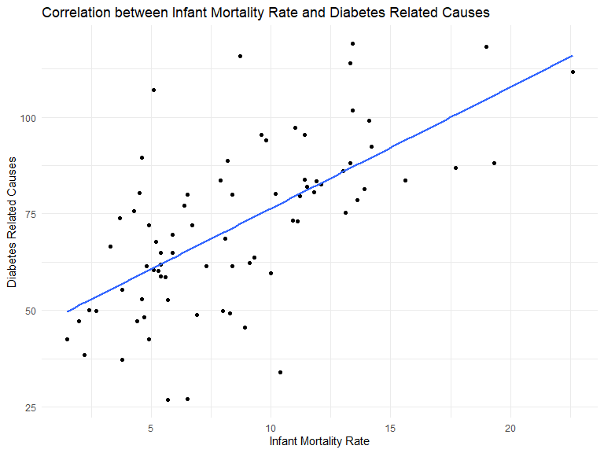

## Mapping

The mapping of community areas by infant mortality rate reveals that the
community areas with the highest infant mortality rates are in the south
and west sides of Chicago, with areas of low infant mortality
interspersed. Another mapping of the per capita income variable displays
that the lowest average incomes in community areas roughly line up with
the highest infant mortality rates. Of course this isn’t terribly
surprising since unfortunately those lower income Chicagoans likely have
less access to healthcare in general. The highest per capita incomes are
people living downtown, where infant mortality falls in the second
lowest quartile range of infant mortality. The mapping of our
unemployment rate indicator shows the highest unemployment rates in the
center of the map, in an area we haven’t discussed yet. Areas with
higher infant mortality rates have above average rates of unemployment
as well, but don’t appear to affect it in a perfectly graphed way.

> **Note**: *This was originally an interactive map (viewable in HTML only). Static image shown below.*

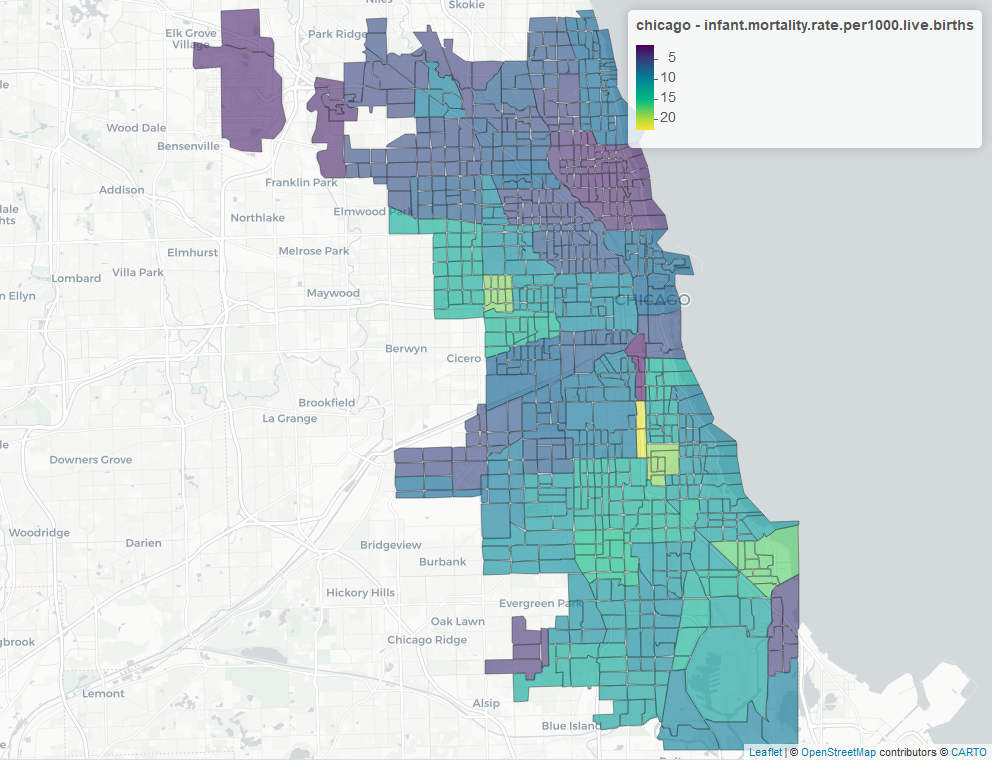

> **Note**: *This was originally an interactive map (viewable in HTML only). Static image shown below.*

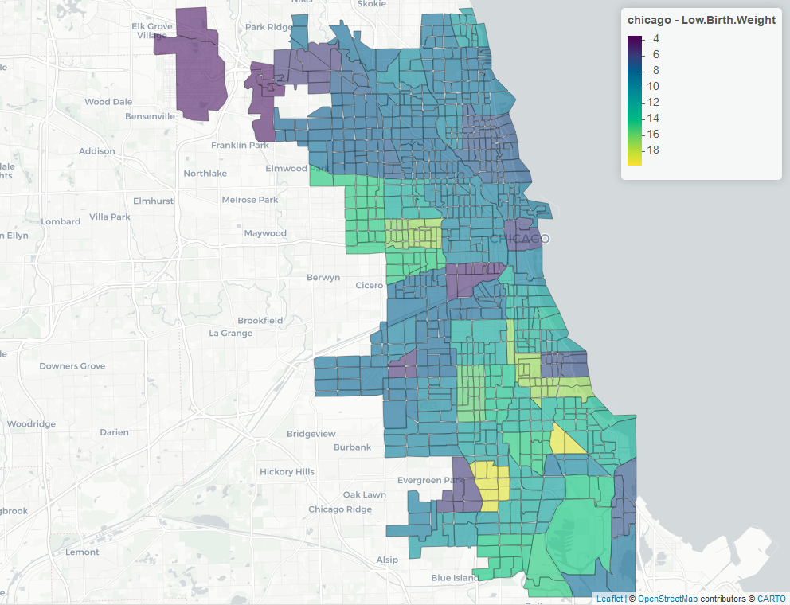

> **Note**: *This was originally an interactive map (viewable in HTML only). Static image shown below.*

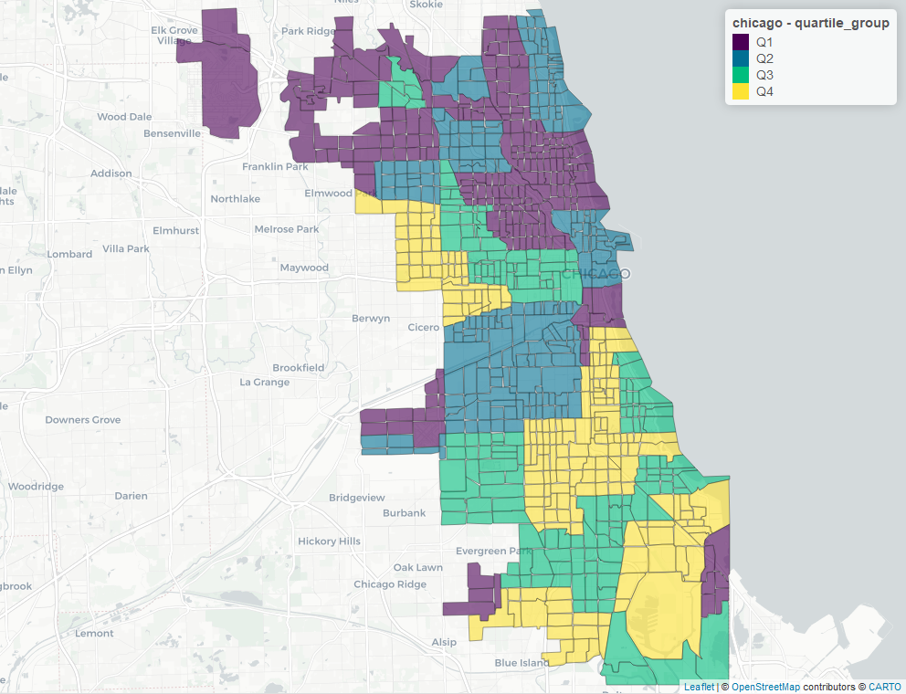

> **Note**: *This was originally an interactive map (viewable in HTML only). Static image shown below.*

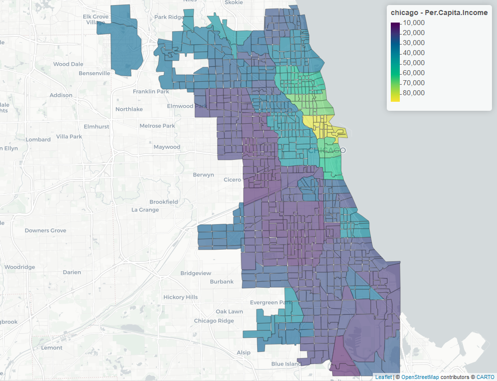

> **Note**: *This was originally an interactive map (viewable in HTML only). Static image shown below.*

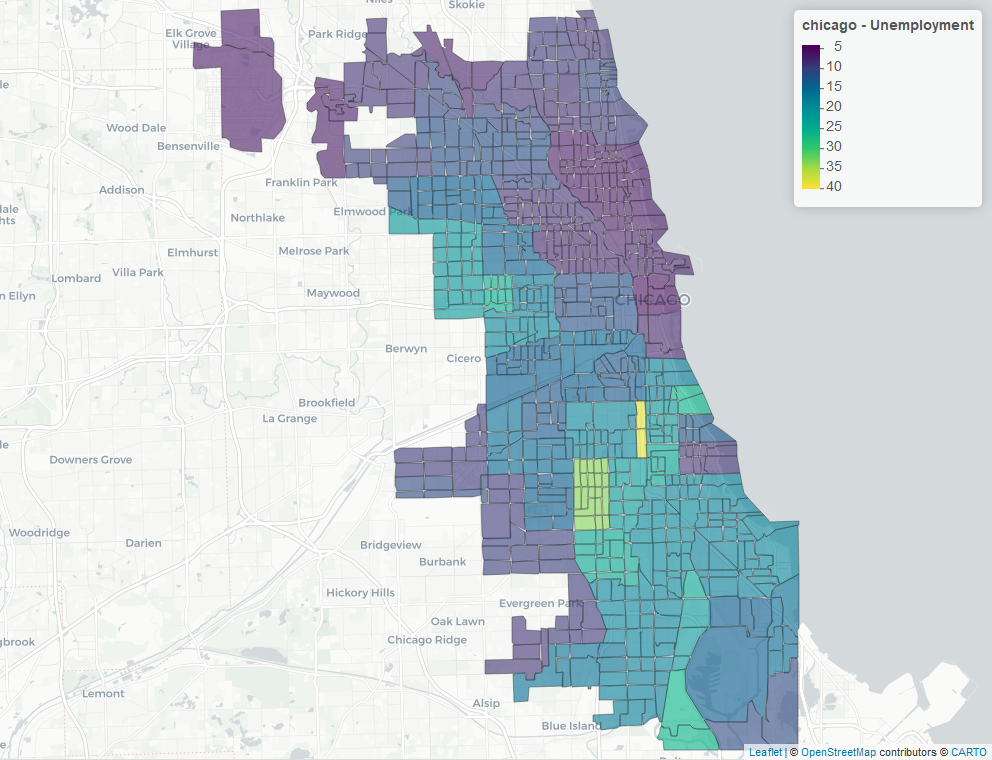

> **Note**: *This was originally an interactive map (viewable in HTML only). Static image shown below.*

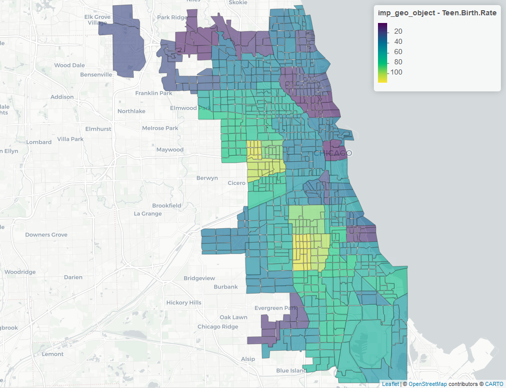

> **Note**: *This was originally an interactive map (viewable in HTML only). Static image shown below.*

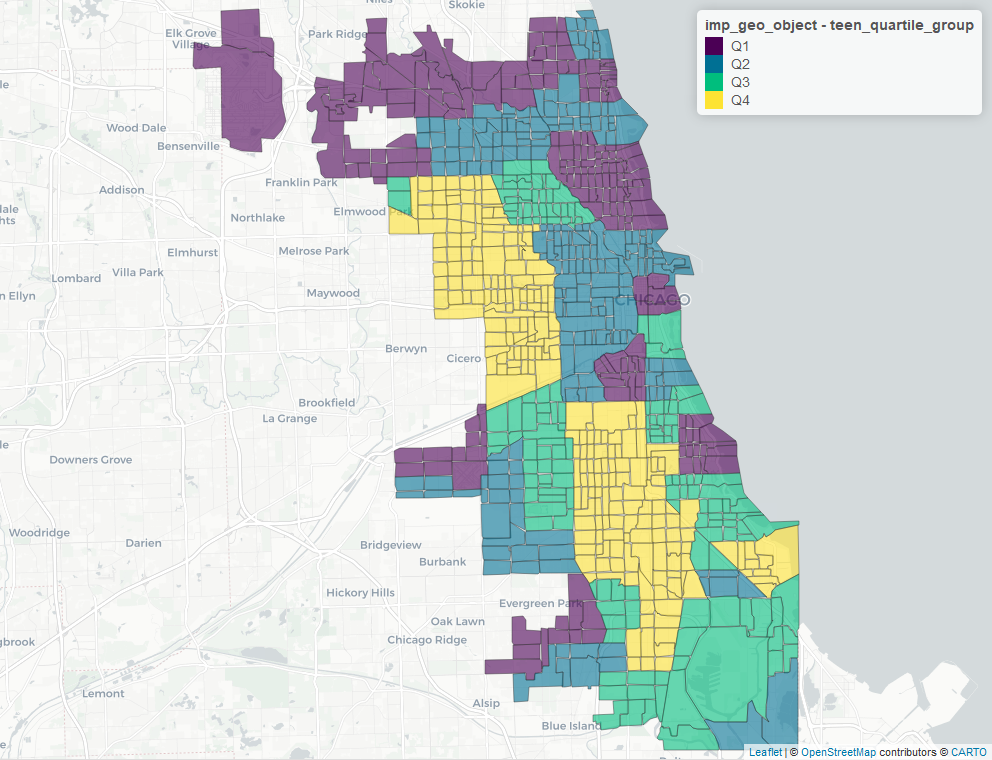

# Model Training

## Linear Regression

The first model we implemented was a linear regression model on all the
socioeconomic factors. However, after running the model, we realized
that only the only variables with significance were `teen birth rate`
and `unemployment`. As a result we decided to use backward selection to
reduce the input variables to see if we could get a model with higher
significance. Using this method, we ended up with three significant
variables: `unemployment`, `teen birth rate`, and
`no high school diploma`. The reason for these three variables being
significant could be related to the financial state/average income for
the people in these areas. This factor may directly relate to financial
challenges of maintaining proper nourishment and fostering a healthy
pregnancy.

We then did the same analysis but with mortality factors instead. For
the full model, only `prostate cancer in males` showed weak
significance. However, after backward selection, we ended with one
variable significant at the 0.01 level: `assault homicide`, two
variables significant at the 0.05 level: `cancer all sites` and
`prostate cancer in males`, and one variable significant at the 0.1
level: \`lung cancer. The significance of these variables might be
explained by the stress brought on by having or caring for someone
dealing with cancer, assault and/or homicide. These factors may lead to
an unhealthy pregnancy, potentially jeopardizing the health of an unborn
child.

## LASSO Regression

In order to run a lasso-based regression we first had to do some
analysis to find the appropriate lambda value to use. In order to find
this value we plotted the lambda values to find the coefficients
associated with the lowest mean squared error value. This code extracted
the coefficients at the optimal value of lambda (which minimizes
cross-validation error). We made sure to do this in order to get the
most reliable model coefficients. After determining which predictors
(variables) are most important from the LASSO model, we were able to
build a linear regression model (linear.lasso) using only these
predictors: `teen birth rate`, `unemployment`, `assault homicide`,
`breast cancer in females`, `cancer all sites`, `colorectal cancer`,
`prostate cancer in males`. From this model we were then able to take a
look at the summary results and then use `forecast` to make predictions
using our test data. It applies the model to the test data and generates
forecasts (predictions) for the `infant mortality rate` variable. Lastly
we used `accuracy` to compare the predicted values to the actual values
in the test data to assess model performance. It resulted in an MAPE
value of 25.8%.

<!-- -->

## Neural Network

We also decided to attempt a Neural Network approach as we hoped its
complexity may reveal patterns that simpler models may not. By using the
normalized version of the significant variables from backward
regression, we reduced the risk of the neural network becoming too
complex and potentially overfitting the data. Since we have already
reduced the number of variables through backward regression, we gave the
neural network a more focused input, which can speed up training and
potentially lead to better generalization. We decided to use two hidden
layers that both have two nodes. We visualized our neural network and
then evaluated the model’s prediction once again by comparing predicted
values to the actual ones. This model produced an MAPE of 94.6.

## Double Debiased Model

Throughout our model building process, we realized the strong presence
of the ‘assault and/or homicide’ factor and its significance in
predicting infant mortality rate. Thus we decided to run a double
debiased model in order to explore the causal effect of
`assault and/or homicide` on `infant mortality rate`. The 2 models we
ran were a linear regression and a random forest.

The linear showed a strong statistical relationship between Assualt
Homicide and Infanat Mortality Rate. However, the random forest model
didn’t show a significant statistical relationship. This difference
hints that the relationship between the two is available but may not be
purely linear. Rather, it is better as being one of many predictors
rather than a sole predictor. This could be because it becomes
significant after a certain threshold rather than at all levels. It
could also just be based on what a high rate represents
socioeconomically, which ultimately leads to a higher infant mortality
rate.

## Model Comparison

As you can see above, across all metrics, the LASSO regression model
outperforms the neural network. This could be because of the lack of
tuning of the neural network, the overfitting that neural network is
prone to, or the strength of the linear relationship between infant
mortality and the variables selected by the LASSO model. Therefore, for
prediction, the LASSO model would be more suitable.

<table class="table table-striped table-hover table-condensed" style="color: black; width: auto !important; margin-left: auto; margin-right: auto;">
<caption>
Model Accuracy Comparison
</caption>
<thead>
<tr>
<th style="text-align:left;">
</th>
<th style="text-align:right;">
ME
</th>
<th style="text-align:right;">
RMSE
</th>
<th style="text-align:right;">
MAE
</th>
<th style="text-align:right;">
MPE
</th>
<th style="text-align:right;">
MAPE
</th>
<th style="text-align:right;">
MASE
</th>
<th style="text-align:left;">
Model
</th>
</tr>
</thead>
<tbody>
<tr>
<td style="text-align:left;">
Test set…1
</td>
<td style="text-align:right;">
-0.317
</td>
<td style="text-align:right;">
2.55
</td>
<td style="text-align:right;">
1.72
</td>
<td style="text-align:right;">
-22.1
</td>
<td style="text-align:right;">
33.6
</td>
<td style="text-align:right;">
0.483
</td>
<td style="text-align:left;">
Lasso Regression
</td>
</tr>
<tr>
<td style="text-align:left;">
Test set…2
</td>
<td style="text-align:right;">
-0.567
</td>
<td style="text-align:right;">
3.35
</td>
<td style="text-align:right;">
2.19
</td>
<td style="text-align:right;">
-29.0
</td>
<td style="text-align:right;">
41.2
</td>
<td style="text-align:right;">
NA
</td>
<td style="text-align:left;">
Neural Network
</td>
</tr>
</tbody>
</table>

# Conclusions

The results from our analysis suggest that infant mortality rates in
Chicago are deeply influenced by a combination of socioeconomic and
health-related factors. The linear regression model revealed a
significant relationship between teen birth rates, unemployment, and
infant mortality, while our more complex models, such as the Lasso
regression and Neural Network, provided additional insights into the
predictive power of these variables. The Double Debiased Model
specifically highlighted the strong causal effect of assault and
homicide rates on infant mortality, showing that areas with higher crime
rates tend to experience worse health outcomes for infants. However, the
random forest model did not produce a significant relationship,
indicating that the link between assault homicide and infant mortality
may be non-linear and influenced by other socio-economic factors.

The Neural Network model, with updated results, showed improved
performance compared to earlier iterations. However, the high MAPE of
47.8% suggests that while the model has captured some complex
relationships, it still struggles with accuracy and generalization
across all community areas. This indicates that, despite the potential
for capturing intricate patterns, Neural Networks may not always
outperform simpler models in this context. The key takeaway from our
findings is that policies addressing socioeconomic inequality—such as
improving access to education, reducing unemployment, and providing
better healthcare and social services—could significantly reduce
disparities in infant mortality across Chicago’s community areas.
Targeted interventions that address both the immediate and underlying
health and socioeconomic challenges faced by these communities will be
crucial for improving public health outcomes. Further research and
refined models, particularly those that consider non-linear
relationships and causal effects, are needed to continue improving our
understanding of the factors contributing to infant mortality.

# Appendix

<https://data.cityofchicago.org/api/assets/2107948F-357D-4ED7-ACC2-2E9266BBFFA2>
This is a link to further explanation and information regarding the
Chicago Health Atlas data that we used. This first couple pages of the
document contains a brief description of the dataset and details as to
how the data was collected and reported. The third and fourth pages
provide a breakdown of the many variables into four overarching
categories: natality, mortality, lead, infectious, and economic.

<https://data.cityofchicago.org/Health-Human-Services/Public-Health-Statistics-Selected-public-health-in/iqnk-2tcu/data_preview>

This link takes you to the direct page that we downloaded the Chicago
Health Atlas data from.

<https://www.actforchildren.org/about/research-data/data/>

This link will take you directly to the page we downloaded the Illinois
Action for Children dataset from. We downloaded the Excel file under
Cook County Childcare Data \< By Chicago Community Area and performed
some preliminary cleaning specifically with the headers in Excel itself
before importing it into R.
